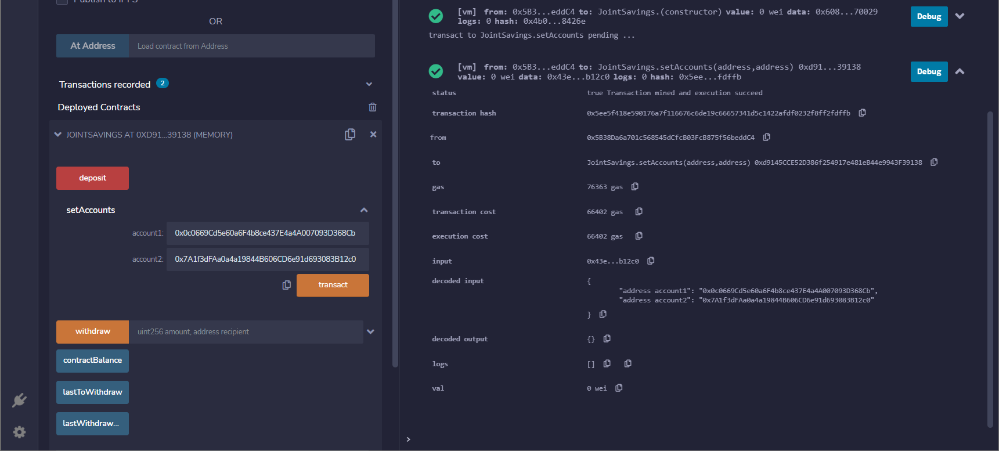
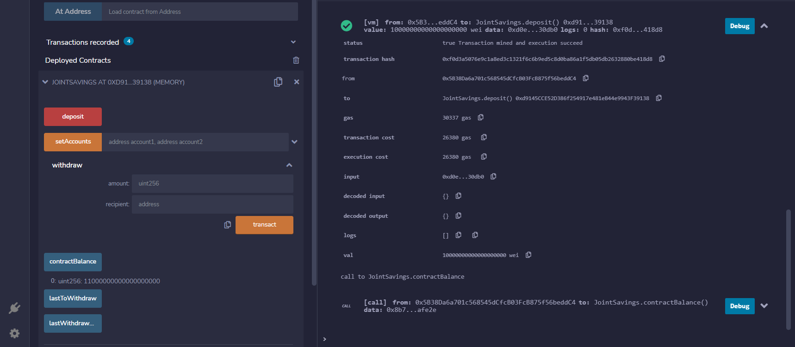
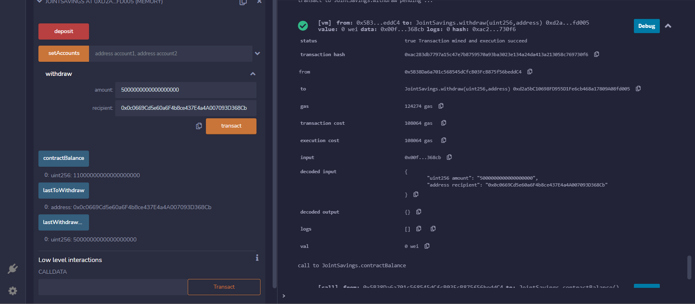

# Joint Savings Account Smart Contract
 
This Solidity smart contract will allow joint users to transfer Ethereum between each other's authorized accounts. Once the addresses are set and Ethereum is deposited into the contract's balance, then the deposited Ethereum can then be distributed between the accounts.

 

# Usage
The below screenshots highlights the usage of the smart contract:

 

Setting dummy addresses to the contract:

 

Depositing Ethereum into the contract:

 

Distributing Ethereum to an authorized address:

 

More images can be found under the [Execution_Results](./Execution_Results/) folder.

 

# Disclaimer
This smart contract was deployed in a test envrionment, all address used in this example are dummy addresses. **DO NOT** attempt send any Ethereum to these addresses!